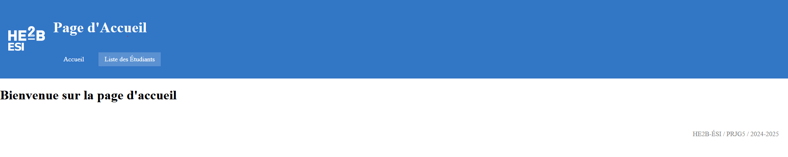
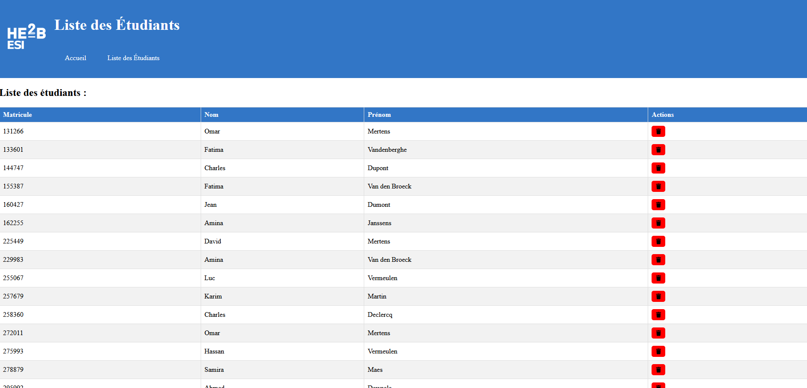

# Esi_attendance

During this exercise, we will be required to build a web application in teams. The main challenge will be coordinating tasks. You will develop this application using the Laravel framework introduced in the WEBG4 module. I'm working with Tazznico aka 57618

## Deploy to Production

1. Switch to the production branch:

```bash
git switch production
```

2.(Only for the first time) Set up deployment (password: "b3Qe,"HXw->7H2!"):

```bash
git remote add deploy tazznico@ssh-tazznico.alwaysdata.net:~/Attendance.git
```

3.Merge with the main branch:

```bash
git merge main
```

4.Deploy to production (password: "b3Qe,"HXw->7H2!"):

```bash
git push deploy production
```

5.Check the changes at the URL: <https://tazznico.alwaysdata.net/students>

## Screenshots


